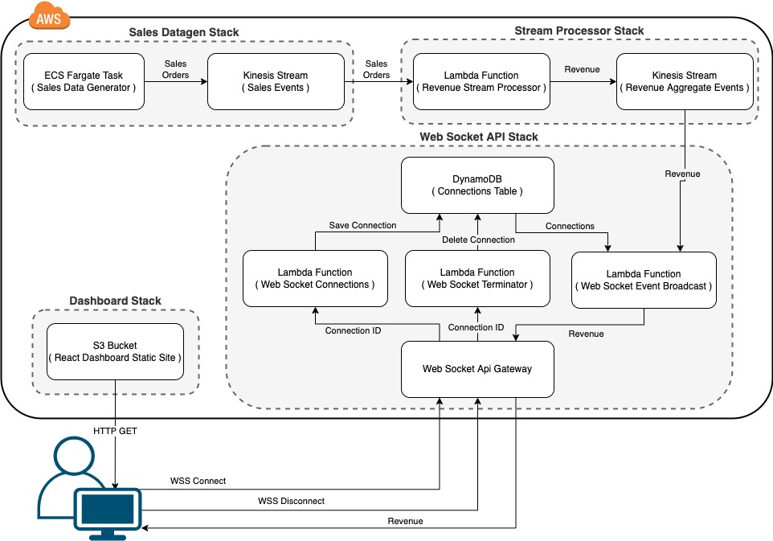

# Event Processing and Web Socket API with AWS CDK Demo Application

This is a demo application that I used to present to [Nebraska.Code()](https://nebraskacode.amegala.com/Sessions) conference on AWS Cloud Development Kit (CDK) with [slides available](./NebraskaCode-AWS-CDK.pdf) in this repo as well.

__Architecture Diagram__




## YouTube Presentation

I also recorded an introductory talk covering AWS CDK along with a detailed walk-thru of this demo application and posted to [YouTube](https://youtu.be/6yYpuVXWoPk)

## Prereqs to Deploying

[Install yarn](https://classic.yarnpkg.com/lang/en/docs/install/#mac-stable)

```
npm install -g yarn
```

[Install CDK](https://docs.aws.amazon.com/cdk/v2/guide/work-with-cdk-typescript.html)

```
npm install -g aws-cdk
```

[Bootstrap](https://docs.aws.amazon.com/cdk/v2/guide/bootstrapping.html) your AWS account to use CDK

```
cdk bootstrap aws://ACCOUNT-NUMBER-1/REGION-1
```

## Deploying the Demo Application

1) Build the frontend application

```
cd lib/dashboard-app
yarn && yarn build
```

2) Build the CDK project

run this from the project root (same directory as the cdk.json file)

```
yarn && yarn build
```

3) Synthesize the CDK project

run this from the project root (same directory as the cdk.json file)

```
yarn synth
```

4) Deploy the CDK project

```
yarn deploy
```

 * `yarn build`   compile typescript to js
 * `yarn deploy`      deploy this stack to your default AWS account/region
 * `yarn cdk diff`        compare deployed stack with current state
 * `yarn synth`       emits the synthesized CloudFormation template
